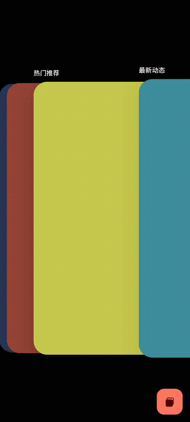
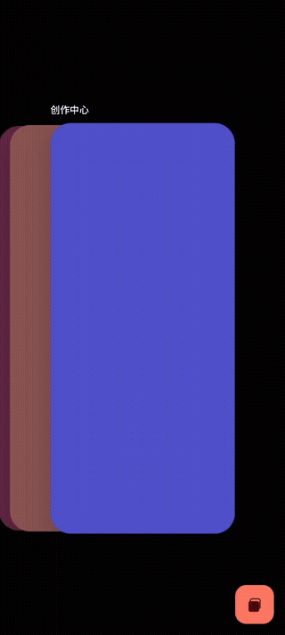
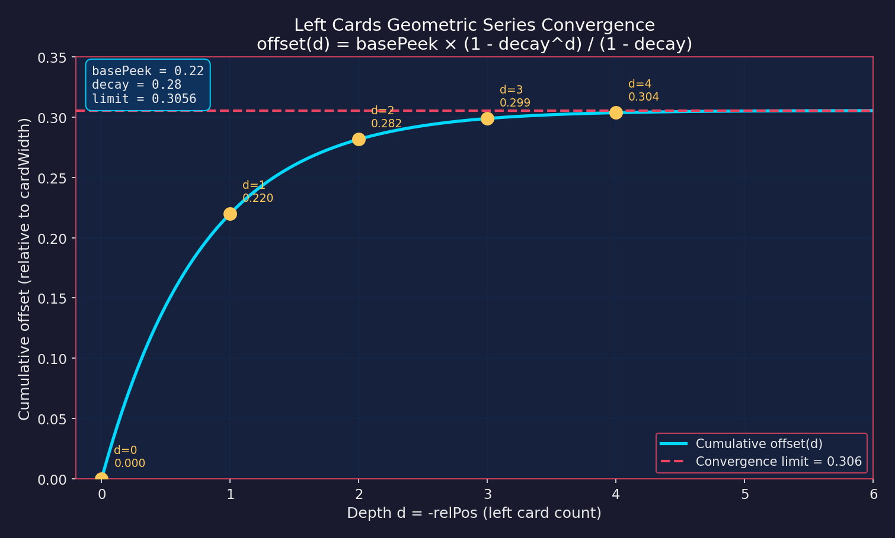
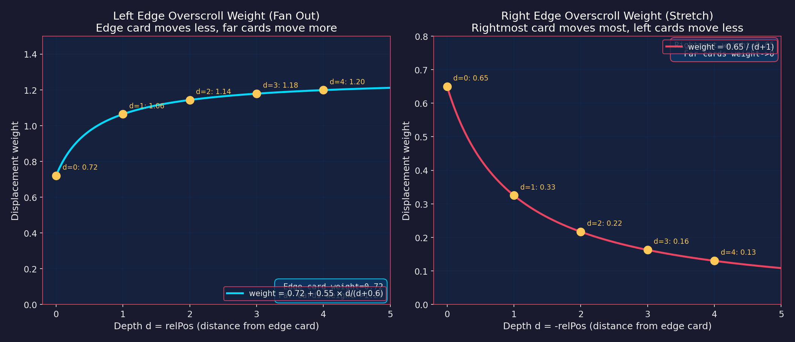
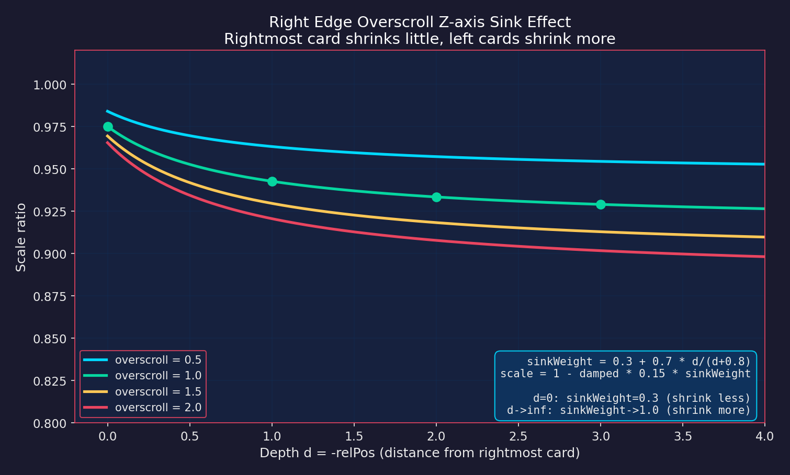
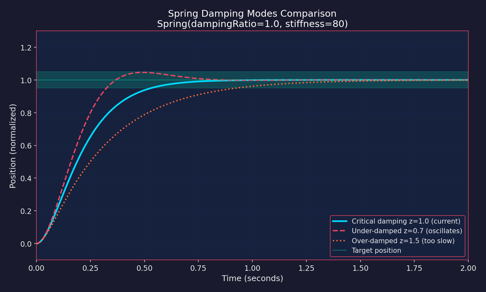

<p align="center">
  
</p>

<h1 align="center">StackSwipe</h1>

<p align="center">
  <strong>像素级还原 iOS 应用切换器的 Jetpack Compose 实现</strong>
</p>

<p align="center">
  <a href="#特性">特性</a> •
  <a href="#演示">演示</a> •
  <a href="#安装">安装</a> •
  <a href="#使用">使用</a> •
  <a href="#物理引擎">物理引擎</a> •
  <a href="#许可证">许可证</a>
</p>

<p align="center">
  
  
  
  
  
</p>

---

## 为什么选择 StackSwipe？

市面上大多数 Android 应用切换器的实现都"差点意思"——卡顿、生硬、手感不对。**StackSwipe** 用数学级精确的物理引擎重现了丝般顺滑的 iOS 应用切换器体验：

- **几何级数堆叠** — 卡片以自然的深度收敛方式堆叠
- **幂律视差** — 右侧卡片移动速度快 20%，营造 iOS 标志性的空间感
- **橡皮筋过度滚动** — 渐进式阻力，不同卡片差异化移动
- **Z 轴深度下沉** — 拉过边缘时卡片在 3D 空间中压缩
- **弹簧动量系统** — 临界阻尼弹簧实现零回弹稳定

**零依赖。纯 Compose 实现。约 600 行代码。**

---

## 演示

<p align="center">
  
  
  
</p>

<p align="center">
  <em>左边缘过度滚动（扇形展开） • 右边缘过度滚动（Z 轴下沉） • 卡片切换</em>
</p>

---

## 特性

| 特性 | 描述 |
|------|------|
| **iOS 级布局精度** | 非对称卡片定位：左侧几何级数、右侧视差效果 |
| **橡皮筋物理** | 流畅的过度滚动，每张卡片差异化移动 |
| **Z 轴深度** | 右边缘过度滚动时卡片向屏幕内下沉 |
| **标题模糊** | 卡片移入堆叠时标题高斯模糊 |
| **深度遮罩** | 堆叠卡片上的深度阴影 |
| **弹簧动画** | 临界阻尼弹簧实现自然动量 |
| **卡片 ↔ 全屏** | 贝塞尔曲线缓动的无缝展开/收起过渡 |
| **截图捕获** | 内置基于 GraphicsLayer 的截图存储 |
| **性能优化** | 屏幕外裁剪、派生状态、形状提升 |

---

## 安装

将源文件添加到你的项目：

```
app/src/main/java/your/package/appswitcher/
├── Models.kt              # NavRoute, BackStackEntry, AppSwitcherState
├── ScreenshotStore.kt     # 截图捕获与存储
├── AppSwitcherCard.kt     # 单个卡片组件
├── AppSwitcherOverlay.kt  # 主切换器覆盖层（约 600 行代码）
└── AppSwitcherDemoScreen.kt  # 演示实现
```

---

## 使用

### 基础设置

```kotlin
@Composable
fun MyAppSwitcher() {
    val entries = remember {
        listOf(
            BackStackEntry(0, NavRoute.Page("首页")),
            BackStackEntry(1, NavRoute.Page("设置")),
            BackStackEntry(2, NavRoute.Page("个人"))
        )
    }

    val screenshotStore = remember { ScreenshotStore() }
    var selectedIndex by remember { mutableIntStateOf(2) }
    var isVisible by remember { mutableStateOf(true) }

    AppSwitcherOverlay(
        backStack = entries,
        screenshotStore = screenshotStore,
        state = AppSwitcherState(isVisible = true, selectedIndex = selectedIndex),
        onCardClick = { index -> selectedIndex = index },
        onSelectedIndexChange = { index -> selectedIndex = index },
        onDismiss = { isVisible = false }
    )
}
```

### 使用真实截图

```kotlin
// 用 ScreenshotCapture 包裹你的页面
ScreenshotCapture(
    key = entry.screenshotKey,
    screenshotStore = screenshotStore
) {
    YourPageContent()
}

// 显示切换器前捕获截图
LaunchedEffect(showSwitcher) {
    if (showSwitcher) {
        screenshotStore.captureAll()
    }
}
```

---

## 物理引擎

> *"好 UI 和优秀 UI 的差别在于数学。"*

### 卡片定位

**左侧 — 几何级数：**
```
offset(d) = basePeek × (1 - decay^d) / (1 - decay)
```
卡片收敛到有限极限（约 30% 卡片宽度）。仅 2-3 张卡片可被视觉区分。

**右侧 — 幂律视差：**
```
x(i) = centerX + relPos^1.2 × rightSpacing
```
1.2 次幂使右侧卡片比线性移动快 20%，营造 iOS 标志性的空间感。



### 橡皮筋过度滚动

**平滑阻尼（无跳变）：**
```kotlin
dampedOverscroll = |overscroll| / (1 + |overscroll| × 0.8)
```

**差异化卡片移动：**
- 左边缘：`weight = 0.72 + 0.55 × d/(d+0.6)` — 扇形展开效果
- 右边缘：`weight = 0.65 / (d+1)` — 最右卡片移动最多



### Z 轴深度下沉

右边缘过度滚动时，卡片随深度缩小：

```kotlin
sinkWeight = 0.3 + 0.7 × d/(d+0.8)
scale = 1 - dampedOverscroll × 0.15 × sinkWeight
```



### 弹簧动画

```kotlin
spring(
    dampingRatio = 1.0,    // 临界阻尼 = 无回弹
    stiffness = 80f        // 低刚度 = 慢速、轻盈的稳定
)
```



---

## 参数

| 参数 | 值 | 用途 |
|------|-----|------|
| 卡片宽度 | 屏幕 66% | 主卡片尺寸 |
| 卡片圆角 | 30dp | iOS 风格圆角 |
| 左侧露出 | 卡片 22% | 堆叠卡片可见条带 |
| 左侧衰减 | 0.28 | 几何级数比率 |
| 右侧间距 | 卡片 85% | 右侧卡片间隔 |
| 视差指数 | 1.2 | 右侧卡片加速系数 |
| 基础摩擦 | 0.70 | 常规拖动阻尼 |
| 边缘摩擦 | 0.6/(1+0.5x) | 渐进式过度滚动阻力 |
| 弹簧阻尼 | 1.0 | 临界阻尼（无回弹） |
| 弹簧刚度 | 80 | 慢速、轻盈的稳定 |
| 动画时长 | 400ms | 卡片 ↔ 全屏 |
| 贝塞尔缓动 | (0.17, 0.84, 0.44, 1.0) | iOS 风格曲线 |

---

## 性能

- **屏幕外裁剪**：无论返回栈大小，仅渲染 3-5 张卡片
- **`derivedStateOf`**：拖动与动画状态隔离
- **形状提升**：`RoundedCornerShape` 仅创建一次
- **稳定键**：高效的 Compose 节点复用

---

## 许可证

MIT 许可证。随意使用、修改、发布。

---

<p align="center">
  <strong>用数学、物理和过度的细节关注打造。</strong>
</p>

<p align="center">
  <sub>iOS 能做到的，Compose 能做得更好。</sub>
</p>
